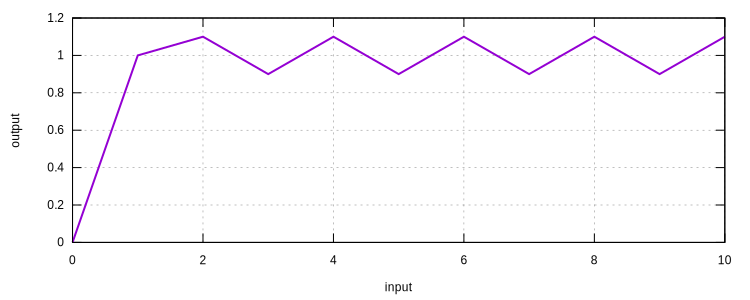

# Triaxial Compression of Sand Using SimpleSand

In this example, we demonstrate the usage of [`SimpleSand`](../../Library/Material/Material3D/Sand/SimpleSand.md) model using conducting a triaxial compression simulation.

The model scripts can be [downloaded](triaxial-compression-of-sand.zip).

## The Model

A unit cube defined with [`C3D8`](../../Library/Element/Cube/C3D8.md) element is used to represent the specimen.

```
node 1 .5 -.5 0
node 2 .5 .5 0
node 3 -.5 .5 0
node 4 -.5 -.5 0
node 5 .5 -.5 1
node 6 .5 .5 1
node 7 -.5 .5 1
node 8 -.5 -.5 1

element C3D8 1 1 2 3 4 5 6 7 8 1 G
```

For the material properties, the following values are used.

```
material SimpleSand 1 9E4 .2 .01 .7 5. 1.25 1.1 3.5 1.915 -130. .02 2.
```

Please refer to the corresponding page for explanations.

## Loading

The confinement is applied to achieve a confinement stress of $$\sigma=1500~\mathrm{kPa}$$.

In this case, a displacement of $$-0.01$$ would do the job.

```
displacement 1 0 -0.01 1 1 2 5 6
displacement 2 0 -0.01 2 2 3 6 7
```

The vertical displacement is applied in the same way. It varies cyclicly after the target confinement is achieved.

```
amplitude Tabular 1 v

displacement 3 1 -0.01 3 5 6 7 8
```

The load level can be plotted as follows.



## Result

The $$p$$-$$q$$ response is shown as follows. As a linear relationship is assumed for elastic part, linear line segments are expected within the yield surface.

The `SimpleSand` model is a very simple model for sand to showcase the concept of bounding surface.


For more advanced response, other models shall be used.
