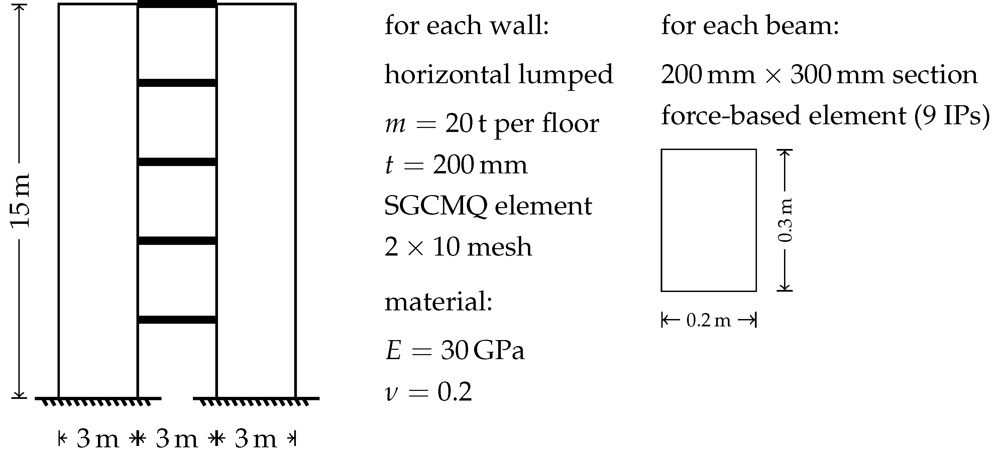
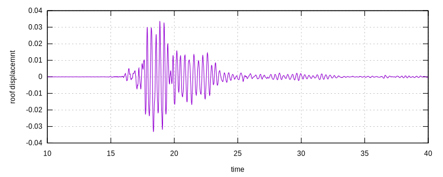

# Response History Analysis of An Elastic Coupled Wall

In this page, we perform eigen analysis and response history analysis of an elastic coupled wall model.

The wall model is a simplified version of the example shown in section 7.2 of this paper: [10.1016/j.engstruct.2020.110760](https://doi.org/10.1016/j.engstruct.2020.110760).

The model can be [downloaded](response-history-analysis-of-an-elastic-coupled-wall.zip).

## Model Brief

The geometry is summarized in the following figure.



Definitions of nodes, elements, materials, boundary conditions are stored in `node.supan` and `element.supan`. Use proper commands to load files.

```
file node.supan
file element.supan
```

## Eigen Analysis

Before performing the eigen analysis, the system is double checked to be symmetric. In fact, as eigen analysis is normally conducted on elastic structures, which are most likely to be symmetric, it is in general not problematic as long as elasto-plastic behavior is not involved.

Now we define a `Frequency` step to compute ten eigenvalues of the generalized eigen problem.

```
step Frequency 1 10
```

Invoke analysis and check the eigenvalues.

```
peek eigenvalue
```

The output is shown as follows.

```
Eigenvalues:
   3.6759e+02
   1.1518e+04
   4.3152e+04
   6.0047e+04
   6.8965e+04
   1.1525e+05
   1.8269e+05
   2.2550e+05
   3.0590e+05
   3.1665e+05
```

Thus the period of the first mode can be computed as

$$
t_1=\dfrac{2\pi}{\omega}=\dfrac{2\pi}{\sqrt{367.59}}\approx0.33~\mathrm{s}.
$$

## Response History Analysis

### Ground Motion

We use one of the recordings of 2011 Christchurch Earthquake, the original raw recording can be obtained from this [page](https://www.geonet.org.nz/data/supplementary/nzsmdb). Please check [NZStrongMotion](../../../Library/Amplitude/Special/NZStrongMotion.md) for more details. The chosen recording has a tag of `20110221_235142_LPCC`, the PGA is $$8.91~\mathrm{m/s^2}$$.

After downloading the processed recording file, the following command can be used to define the amplitude.

```
amplitude NZStrongMotion 1 20110221_235142_LPCC
```

The acceleration is applied to the structure, note `NZStrongMotion` produces normalized (dimensionless) amplitudes, to apply an accelerogram of target PGA, the corresponding magnitude shall be adjusted to be equal to that PGA. In this example, we assign a PGA of $$0.4g$$.

```
acceleration 1 1 3.92 1
```

### Damping Model

The [Lee's damping model](../../../Library/Integrator/Newmark/LeeNewmark.md) is chosen as an illustration. Knowing that $$\omega_1=\sqrt{367.59}=19.17~\mathrm{rad/s}$$, we assign a single basic function at $$\omega_1$$ with $$5\%$$ damping ratio.

```
integrator LeeNewmark 1 .25 .5 .05 19.17
```

### Other Settings

We define a dynamic step and perform the analysis with the time step of $$0.005~\mathrm{s}$$ for $$60~\mathrm{s}$$.

```
step dynamic 1 60
set ini_step_size 5E-3
set fixed_step_size 1

integrator LeeNewmark 1 .25 .5 .05 19.17

converger RelIncreDisp 1 1E-8 10 1

analyze
```

## Some Stats

This example consists of $$83$$ nodes, equivalent to $$249$$ DoFs. With one basic function used in the damping model, the size of matrix solved is about $$500\times500$$. On recent machines, the response history analysis can be done within one minute. The solving time increases almost linearly with an increasing number of basic functions used in the damping model.

## Result

We show roof displacement history to close this example.


