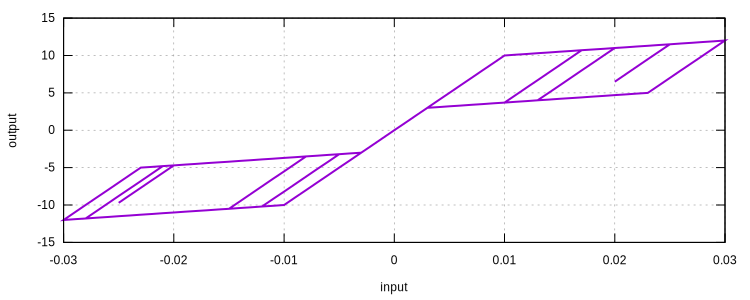
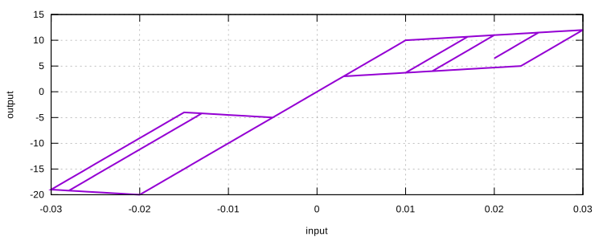

# Flag

Symmetric/Asymmetric Flag

Some self-centering and rocking systems show flag shaped hysteresis behavior. The `Flag01` model defines a symmetric flag shaped hysteresis rule. The `Flag02` model is an extension of the `Flag01` model and defines an asymmetric flag shaped hysteresis rule.

More flexible flag shaped hysteresis behavior can be achieved by combining multilinear elastic model with for example bilinear hardening model.

## Syntax

```
material Flag01 (1) (2) (3) (4) (5)
# (1) int, unique material tag
# (2) double, elastic modulus
# (3) double, yield stress
# (4) double, residual stress
# (5) double, hardening ratio

material Flag02 (1) (2) (3) (4) (5) (6) (7) (8)
# (1) int, unique material tag
# (2) double, elastic modulus
# (3) double, tension yield stress
# (4) double, tension residual stress
# (5) double, tension hardening ratio
# (6) double, compression yield stress
# (7) double, compression residual stress
# (8) double, compression hardening ratio
```

## History Variable Layout

| location                | value                          |
| ----------------------- | ------------------------------ |
| `initialize_history(0)` | tension_reverse_strain         |
| `initialize_history(1)` | tension_reverse_low_strain     |
| `initialize_history(2)` | compression_reverse_strain     |
| `initialize_history(3)` | compression_reverse_low_strain |

## Remarks

1. `Flag01` is a wrapper of `Flag02`.

## Usage

```
material Flag01 1 1000 10 3 .1
materialTest1D 1 1E-3 20 2 7 5 10 20 10 50 10 5 20 10 12 25 40
exit
```



```
material Flag02 1 1000 10 3 .1 20 5 -.1
materialTest1D 1 1E-3 20 2 7 5 10 20 10 50 10 5 20 10 12 25 40
exit
```


