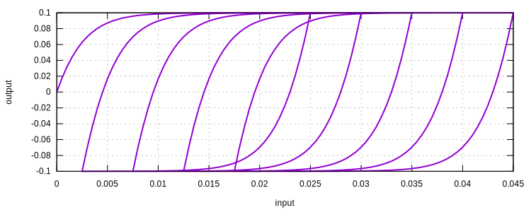

# ArmstrongFrederick1D

1D Armstrong-Frederick Steel Model

This model is a uniaxial version of the [Armstrong-Frederick](../../Material3D/vonMises/ArmstrongFrederick.md) steel model.

## Theory

A von Mises type yield function is used. The associated plasticity is assumed. Both isotropic and kinematic hardening rules are employed.

### Isotropic Hardening

An exponential function is added to the linear hardening law.

$$
k=\sigma_y+k_s(1-e^{-mp})+k_lp,
$$

where $$\sigma_y$$ is the initial elastic limit (yielding stress), $$k_s$$ is the saturated stress, $$k_l$$ is the linear hardening modulus, $$m$$ is a constant that controls the speed of hardening, $$\mathrm{d}p=\Big|\mathrm{d}\varepsilon^p\Big|$$ is the rate of accumulated plastic strain $$p$$.

### Kinematic Hardening

The Armstrong-Frederick type rule is used. Multiple back stresses are defined,

$$
\beta=\sum\beta^i
$$

in which

$$
\mathrm{d}\beta^i=a^i~\mathrm{d}\varepsilon^p-b^i\beta~\mathrm{d}p,
$$

where $$a^i$$ and $$b^i$$ are material constants.

## Syntax

```
material ArmstrongFrederick1D (1) (2) (3) (4) (5) (6) [(7) (8) ...] [9]
# (1) int, unique material tag
# (2) double, elastic modulus
# (3) double, yield stress
# (4) double, saturated stress
# (5) double, linear hardening modulus
# (6) double, m
# (7) double, a
# (8) double, b
# [9] double, density, default: 0.0
```

## Example

### Kinematic Hardening Only With No Elastic Range

```
material ArmstrongFrederick1D 1 2E2 0. 0. 0. 0. 50 500.
```

The maximum stress  can be computed as

$$
\sigma_{max}=\sigma_y+\sum\dfrac{a^i}{b^i}=100~\mathrm{MPa}.
$$


